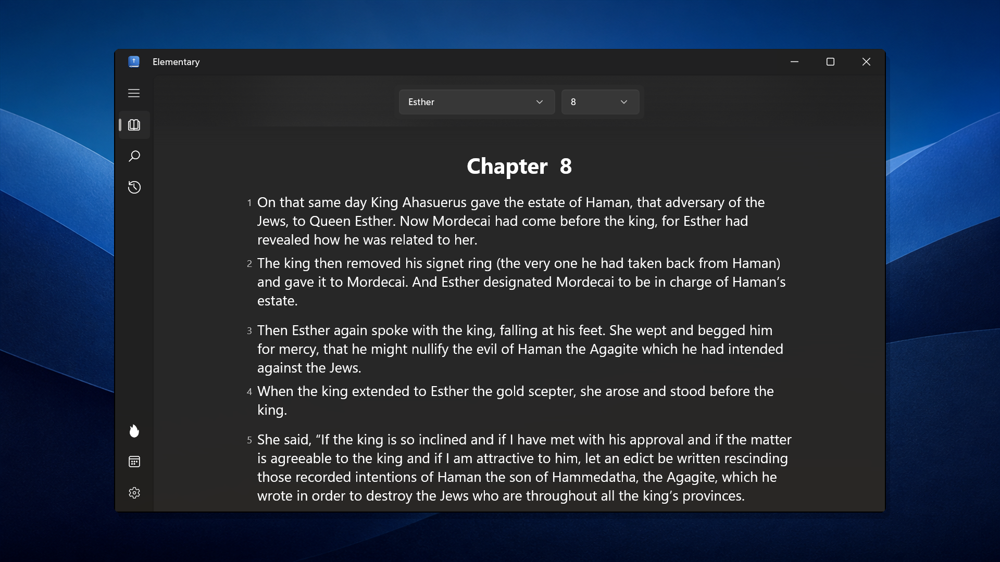
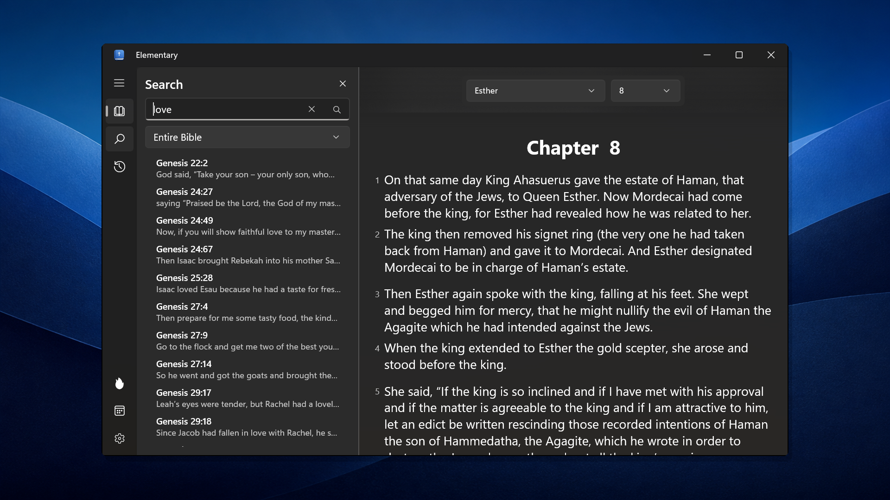
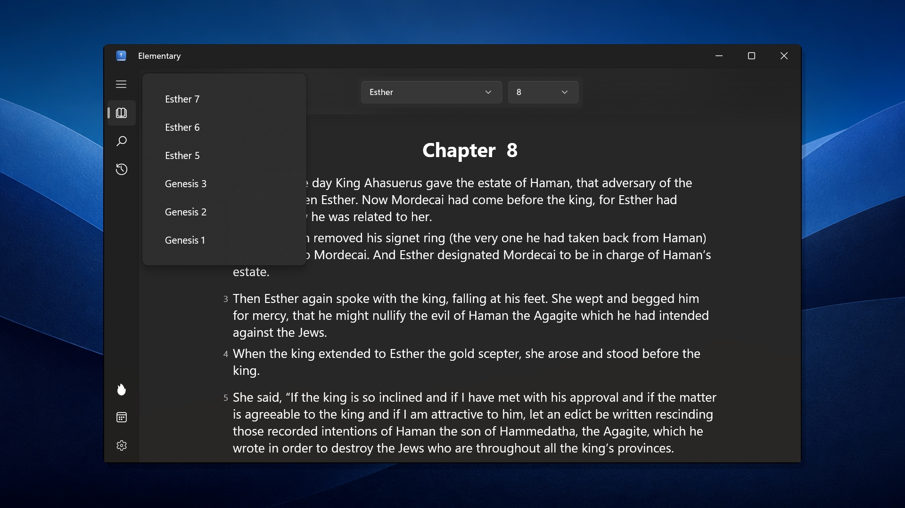
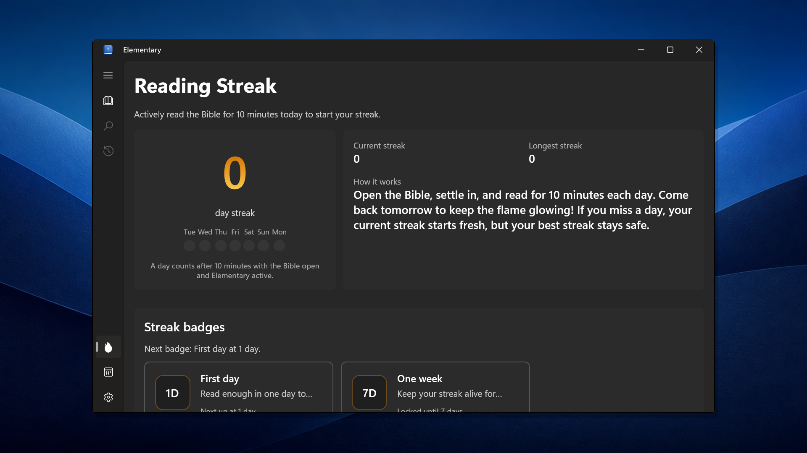
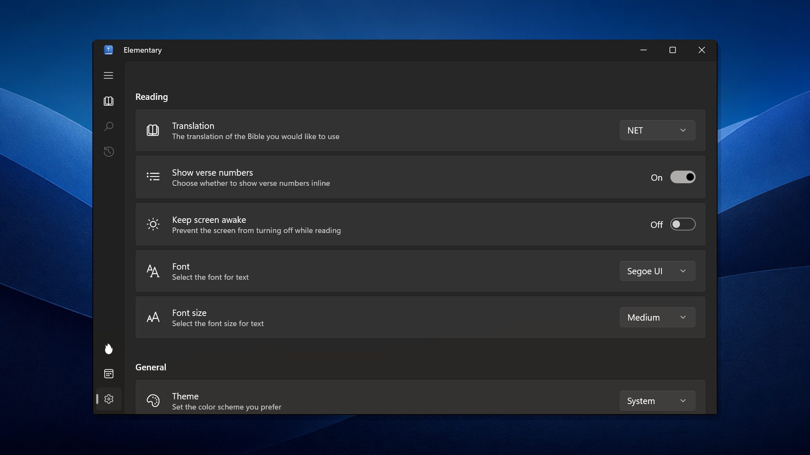

<a id="readme-top"></a>

<div align="center">
  <a href="https://github.com/EzraWard/Elementary">
    
  </a>

  <h1>Elementary Bible</h1>

  <p>A calm, focused Bible reader built for Windows.</p>

  <p>
    <a href="https://github.com/EzraWard/Elementary/releases"></a>
    <a href="https://github.com/EzraWard/Elementary/stargazers"></a>
    <a href="https://github.com/EzraWard/Elementary/issues"></a>
    <a href="LICENSE.txt"></a>
  </p>

  <p>
    <a href="https://github.com/EzraWard/Elementary/releases">Releases</a>
    ·
    <a href="https://github.com/EzraWard/Elementary/issues/new?labels=bug">Report a bug</a>
    ·
    <a href="https://github.com/EzraWard/Elementary/issues/new?labels=enhancement">Request a feature</a>
  </p>
</div>

<p align="center">
  
</p>

## About

Elementary is a distraction-free Bible reader for Windows. It opens directly to Scripture, works without an account, and keeps reading position, history, preferences, and streak progress on the device.

Version 1.0.0 brings together offline translations, continuous reading across chapters and books, full-Bible search, reading history, reading streaks and badges, flexible typography, theme controls, and a refreshed Windows visual identity.

## Features

- Read the NET Bible, King James Version, and American Standard Version offline.
- Scroll continuously across chapter and book boundaries without losing your place.
- Search the entire Bible or limit results to the Old or New Testament.
- Return to any of the ten most recently visited chapters from reading history.
- Build a private, on-device reading streak and unlock milestones from one day through one year.
- Choose light, dark, or system themes; Segoe UI or Georgia; three text sizes; and optional verse numbers.
- Keep the display awake during longer reading sessions when desired.
- View Verse of the Day with locally rendered abstract artwork and an offline fallback.
- Use the app without an account, advertisements, or sign-in.

## Screenshots

| Search | Reading history |
| --- | --- |
|  |  |

| Reading streak | Settings |
| --- | --- |
|  |  |

## Requirements

To run Elementary:

- Windows 10 version 1809 (build 17763) or later
- An x86, x64, or ARM64 Windows device

The Microsoft Store release is being prepared. Development and test builds are available by building the project from source.

## Build from source

You will need:

- Visual Studio with the Universal Windows Platform development workload
- Windows SDK 10.0.28000.0
- .NET 10 SDK for the test and preview projects

Clone the repository and open `src/Elementary.slnx` in Visual Studio. Build `Elementary.UWP` with Visual Studio MSBuild rather than `dotnet build`.

From a Visual Studio Developer PowerShell prompt, an ARM64 Debug build can be run with:

```powershell
MSBuild src\Elementary.UWP\Elementary.UWP.csproj `
  /t:Build `
  /p:Configuration=Debug `
  /p:Platform=ARM64 `
  /p:AppxPackageValidationEnabled=false `
  /p:AppxBundle=Never
```

Run the portable test suite with:

```powershell
dotnet test src\Elementary.Tests\Elementary.Tests.csproj
```

## Project structure

- `src/Elementary.UWP` — Windows application, XAML UI, packaging manifest, and app assets
- `src/Elementary.Core` — Bible loading, search, settings, history, and streak logic
- `src/Elementary.VerseOfTheDay` — Verse retrieval, caching, and image composition
- `src/Elementary.Tests` — portable unit tests
- `src/Elementary.WidgetApp` — experimental future Windows Widget provider; not included in 1.0
- `store-assets` — Microsoft Store listing copy, screenshots, icon, and promotional artwork

## Privacy

Elementary does not require an account. Reading position, history, settings, and streak data remain in the app's local Windows storage.

The bundled Bible translations are available offline. Verse of the Day requests the daily verse from Bible.org over HTTPS and falls back gracefully when that service is unavailable. The artwork itself is generated locally; no third-party photography service is used.

The working publication draft is available in [`store-assets/PRIVACY-POLICY-DRAFT.md`](store-assets/PRIVACY-POLICY-DRAFT.md). It must be finalized and published at a stable HTTPS URL before Store submission.

## Roadmap

- [x] Offline NET, KJV, and ASV translations
- [x] Full-Bible and testament-scoped search
- [x] Reading history
- [x] Reading streaks and badges
- [x] Continuous reading across books and chapters
- [x] Verse of the Day artwork without third-party photography
- [ ] Windows Widget integration
- [ ] Reading plans
- [ ] Additional accessibility, localization, and performance improvements

See the [open issues](https://github.com/EzraWard/Elementary/issues) for proposed features and known issues.

## Contributing

Contributions and thoughtful issue reports are welcome.

1. Fork the repository.
2. Create a branch from `main`.
3. Make and test your changes.
4. Commit with a clear description.
5. Open a pull request against `main`.

Please do not commit generated packages, build output, logs, local databases, credentials, or Visual Studio state.

## Licensing and acknowledgements

Elementary's source code is available under the [MIT License](LICENSE.txt). Bundled Bible texts and third-party components remain subject to their respective copyright and license terms; the MIT license does not replace those terms.

Acknowledgements for the selected Bible translation are available from the app's Settings page.

## Contact

Ezra Ward — [ezra.ward@outlook.com](mailto:ezra.ward@outlook.com)

Project: [github.com/EzraWard/Elementary](https://github.com/EzraWard/Elementary)

<p align="right">(<a href="#readme-top">back to top</a>)</p>
