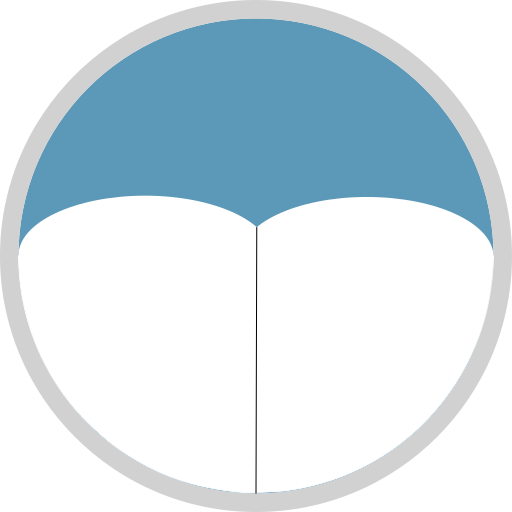
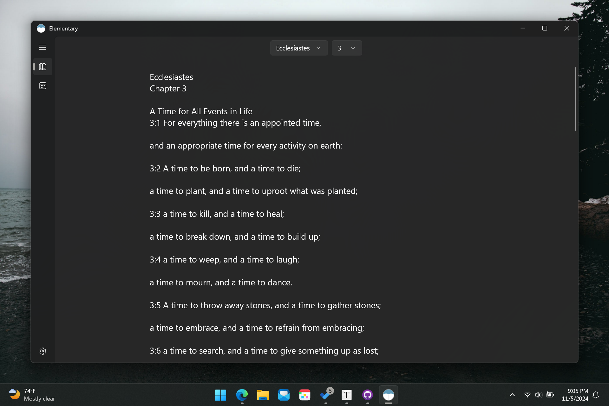

[![Contributors][contributors-shield]][contributors-url]
[![Forks][forks-shield]][forks-url]
[![Stargazers][stars-shield]][stars-url]
[![Issues][issues-shield]][issues-url]
[![MIT License][license-shield]][license-url]
[![LinkedIn][linkedin-shield]][linkedin-url]

<!-- PROJECT LOGO -->

 

  

<h3 align="center">Elementary</h3>

    Elementary is a very simple and usable Windows Bible app with a focus on the reading experience.
     
     
    <a href="https://github.com/EzraWard/Elementary/issues/new?labels=bug">Report Bug</a>
    ·
    <a href="https://github.com/EzraWard/Elementary/issues/new?labels=enhancement">Request Feature</a>
  

<!-- ABOUT THE PROJECT -->

## About The Project

Here's a blank template to get started: To avoid retyping too much info. Do a search and replace with your text editor for the following: `EzraWard`, `Elementary`, `twitter_handle`, `linkedin_username`, `email_client`, `email`, `Elementary`, `project_description`

(<a href="#readme-top">back to top</a>)

### Built With

* [Universal Windows Platform (https://learn.microsoft.com/en-us/windows/uwp/get-started/universal-application-platform-guide)

(<a href="#readme-top">back to top</a>)

<!-- GETTING STARTED -->

## Getting Started

This is an example of how you may give instructions on setting up your project locally.
To get a local copy up and running follow these simple example steps.

### Prerequisites

This is an example of how to list things you need to use the software and how to install them.

## Roadmap

- [ ] Feature 1
- [ ] Feature 2
- [ ] Feature 3
  - [ ] Nested Feature

See the [open issues](https://github.com/EzraWard/Elementary/issues) for a full list of proposed features (and known issues).

(<a href="#readme-top">back to top</a>)

<!-- CONTRIBUTING -->

## Contributing

Contributions are what make the open source community such an amazing place to learn, inspire, and create. Any contributions you make are **greatly appreciated**.

If you have a suggestion that would make this better, please fork the repo and create a pull request. You can also simply open an issue with the tag "enhancement". 

Don't forget to give the project a star! Thanks again!

1. Fork the Project
2. Create your Feature Branch (`git checkout -b feature/AmazingFeature`)
3. Commit your Changes (`git commit -m 'Add some AmazingFeature'`)
4. Push to the Branch (`git push origin feature/AmazingFeature`)
5. Open a Pull Request

(<a href="#readme-top">back to top</a>)

### Top contributors:

<!-- LICENSE -->

## License

Distributed under the MIT License. See `LICENSE.txt` for more information.

(<a href="#readme-top">back to top</a>)

<!-- CONTACT -->

## Contact

Ezra Ward - [@twitter_handle](https://twitter.com/twitter_handle) - ezra.ward@outlook.com

Project Link: [https://github.com/EzraWard/Elementary](https://github.com/EzraWard/Elementary)

(<a href="#readme-top">back to top</a>)

<!-- ACKNOWLEDGMENTS -->

<!-- ## Acknowledgments

* 
* 
*  

(<a href="#readme-top">back to top</a>)
 -->

<!-- MARKDOWN LINKS & IMAGES -->

<!-- https://www.markdownguide.org/basic-syntax/#reference-style-links -->

[contributors-shield]: https://img.shields.io/github/contributors/EzraWard/Elementary.svg?style=for-the-badge

[contributors-url]: https://github.com/EzraWard/Elementary/graphs/contributors

[forks-shield]: https://img.shields.io/github/forks/EzraWard/Elementary.svg?style=for-the-badge

[forks-url]: https://github.com/EzraWard/Elementary/network/members

[stars-shield]: https://img.shields.io/github/stars/EzraWard/Elementary.svg?style=for-the-badge

[stars-url]: https://github.com/EzraWard/Elementary/stargazers

[issues-shield]: https://img.shields.io/github/issues/EzraWard/Elementary.svg?style=for-the-badge

[issues-url]: https://github.com/EzraWard/Elementary/issues

[license-shield]: https://img.shields.io/github/license/EzraWard/Elementary.svg?style=for-the-badge

[license-url]: https://github.com/EzraWard/Elementary/blob/master/LICENSE.txt

[linkedin-shield]: https://img.shields.io/badge/-LinkedIn-black.svg?style=for-the-badge&logo=linkedin&colorB=555

[linkedin-url]: https://linkedin.com/in/linkedin_username

[product-screenshot]: images/screenshot.png

